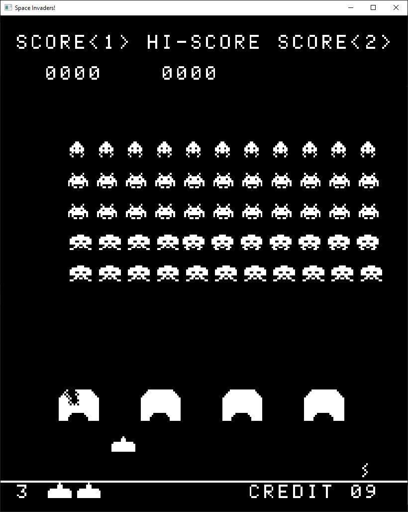

# Space Invaders

A Space Invaders emulator written in C using SDL. Emulates the Intel 8080 microprocessor and the arcade cabinet that came along with the game. Download an executable [here](https://github.com/davidtranhq/space-invaders/releases)

## Build

Install the [SDL2](https://www.libsdl.org/download-2.0.php) and [SDL_mixer](https://www.libsdl.org/projects/SDL_mixer/) libraries.

Clone the repo with `git clone https://github.com/davidtranhq/space-invaders`.

Replace the paths in `INCLUDE_FLAGS` and `LIBRARY_FLAGS` in `src/Makefile` with the installed libraries' respective `include` and `lib` paths on your system.

Build the project with `make` (or `mingw32-make` on Windows).

## Preview

